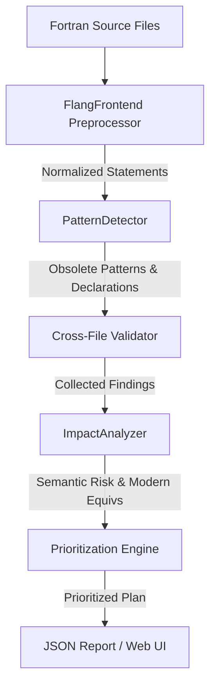

# DESIGN: Technical Design & Alternatives

This document outlines the design decisions, architecture, and alternative approaches evaluated during the development of the Flang Modernization Advisor.

---

## 1. Architectural Overview

The Flang Modernization Advisor is structured as a multi-stage static analysis pipeline, designed to process legacy Fortran files and output an ordered modernization plan.

The pipeline contains five core components:
1. **`FlangFrontend`**: Normalizes lexical quirks of legacy Fortran (e.g., whitespace insensitivity, fixed-form column formatting, line continuations, and comment styles) into a stream of statement objects containing clean source text and location mapping.
2. **`PatternDetector`**: Scans the normalized statement stream for specific obsolete constructs and extracts layout information (like `COMMON` block structures and `USE`/`CALL` dependency graphs).
3. **Cross-File Validator**: Runs checks over the global workspace to flag structural layout mismatches in `COMMON` blocks and call graph inconsistencies (like undefined subroutines or modules).
4. **`ImpactAnalyzer`**: Classifies detected patterns into semantic risk profiles, generates refactoring recommendations (legacy vs. modernized equivalents), and assesses code impact.
5. **`Prioritization Engine`**: Scores modernization targets based on effort and safety, outputting a sorted checklist of actionable tasks.

---

## 2. Technical Approach: Normalized Statement Processing

### Spacing & Case Insensitivity
Legacy Fortran (especially fixed-form F77 and earlier) allows spaces anywhere—even inside keywords and variable names (e.g., `GOTO` can be written as `GO TO`, and `COMMON/block/a,b` can be written as `C O M M O N / b l o c k / a , b`). 
To address this:
- The preprocessor strips all inline whitespaces and converts the statement text to lowercase for regex-free matching.
- **Key Design Decision**: To preserve variable names and spacing for refactoring recommendations, we retain the original source line text (`rawContent`) and map it back using statement line-number indexing.

### Line Continuation Resolution
Fortran supports multi-line statement continuation. 
- In **Fixed-Form**: A non-space/non-zero character in column 6 indicates continuation of the previous line.
- In **Free-Form**: An ampersand (`&`) at the end of a line indicates that the statement continues on the next line.
Our preprocessor automatically merges continuation lines into a single logical statement prior to scanning, ensuring patterns that span multiple lines are not missed.

---

## 3. Alternative Architectures Evaluated

We evaluated three potential designs for the analysis engine:

| Metric | Option A: Line-by-Line Regex (Baseline) | Option B: Full AST via LLVM Flang APIs | Option C: Custom Preprocessor & Statement Parser (Selected) |
| :--- | :--- | :--- | :--- |
| **Parsing Reliability** | Low (misses continuation lines and space variations) | Very High (handles full compiler-level syntax) | High (covers all legacy patterns and continuations) |
| **Portability** | High (standalone Python/C++) | Low (requires LLVM Flang binary libraries) | High (standalone standard C++20) |
| **Refactoring Quality** | Low (only line-based text edits) | High (syntactic tree transformation) | High (logical statement modernization templates) |
| **Cross-file Support** | None | Full semantic analysis | Full structural & Call Graph validation |

### Why Option C Was Selected
1. **Host Portability**: The target environments of modernization (including local legacy workspaces) often lack compiled LLVM Flang libraries (`Flang_DIR-NOTFOUND`). Option C builds out-of-the-box using standard MSVC/GCC/Clang compilers.
2. **Robustness Over Baseline**: Simple line-by-line regexes (Option A) fail to detect multi-line constructs (such as a split `EQUIVALENCE` or `COMMON` block) and cannot normalize fixed-form spacing. Option C's preprocessing stage provides robust statement-level parsing.
3. **Cross-file Capabilities**: We implemented custom symbol collection during the statement pass, enabling the detection of `COMMON` block size/type mismatches and undefined references.
4. **Hybrid WSL Integration**: To achieve the best of both worlds, we implemented a hybrid pathway. When LLVM/Flang 22 dev packages are detected (e.g., in our WSL environment), CMake compiles the project with `-DUSE_FLANG_PARSER` and links the engine against the official `FortranParser` static libraries. This enables native compiler-level syntax validation before running the pattern detection pipeline.

---

## 4. Refactoring Recommendations Logic

Modernization is not just about flagging errors; it's about providing safe migration paths. The Advisor uses predefined mapping templates for modernization:
- **`COMMON` Blocks**: Transformed into modernized `MODULE` declarations containing explicit types.
- **`EQUIVALENCE`**: Flagged as unsafe due to memory aliasing; recommendations suggest using explicit derived types or modern pointers if aliasing is required.
- **Arithmetic IF**: Replaced with structured `IF / ELSE IF / ELSE` blocks.
- **Computed GOTO / Assigned GOTO**: Migrated to modern structured `SELECT CASE` or standard conditional branching.
- **Label DO Loops**: Replaced with clean `DO` / `END DO` blocks, removing obsolete line-label dependencies.
