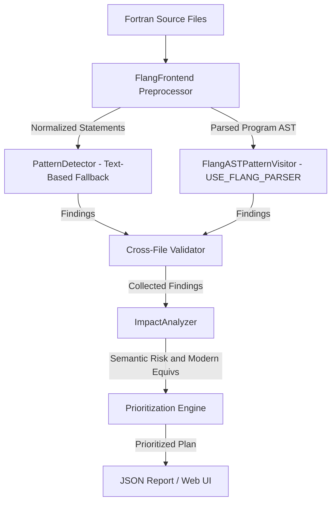

# DESIGN: Technical Design and Alternatives

This document outlines the design decisions, architecture, and alternative approaches evaluated during the development of the Flang Modernization Advisor.

---

## 1. Architectural Overview

The Flang Modernization Advisor is structured as a multi-stage static analysis pipeline, designed to process legacy Fortran files and output an ordered modernization plan.

The pipeline contains six core components:

1. **`FlangFrontend`**: Normalizes lexical quirks of legacy Fortran (whitespace insensitivity, fixed-form column formatting, line continuations, comment styles) into a stream of statement objects. When `USE_FLANG_PARSER` is defined, it also invokes the Flang compiler's native `Prescan` and `Parse` stages, producing a `Fortran::parser::Program` parse tree stored in the `SourceAnalysis` context.
2. **`FlangASTPatternVisitor`** *(WSL/Linux, `USE_FLANG_PARSER` only)*: Traverses the Flang parse tree directly via `Fortran::parser::Walk`, detecting legacy patterns from typed AST nodes rather than text. Source locations are resolved from provenance ranges using `AllCookedSources::GetSourcePositionRange`.
3. **`PatternDetector`**: Scans the normalized statement stream for obsolete constructs. Runs as the primary detector on Windows and as a supplemental pass on WSL/Linux after the AST visitor.
4. **Cross-File Validator**: Runs checks over the global workspace to flag structural layout mismatches in `COMMON` blocks and call graph inconsistencies (like undefined subroutines or modules).
5. **`ImpactAnalyzer`**: Classifies detected patterns into semantic risk profiles, generates refactoring recommendations, and assesses code impact.
6. **`Prioritization Engine`**: Scores modernization targets based on effort and safety, outputting a sorted checklist of actionable tasks.

---

## 2. Dual-Path Detection Architecture

### AST Visitor Layer (WSL/Linux with USE_FLANG_PARSER)

When LLVM Flang 22 development packages are available, the build system sets `-DUSE_FLANG_PARSER`. In this mode:

- `FlangFrontend.cpp` invokes `Fortran::parser::Parsing` (Prescan + Parse), storing the resulting `Program` AST in `SourceAnalysis::parsing` as a `FlangParserHolder`.
- `PatternDetector::detectPatterns` casts `SourceAnalysis::parsing` back to `FlangParserHolder`, retrieves the `Program` and `AllCookedSources`, and instantiates `FlangASTPatternVisitor`.
- `FlangASTPatternVisitor::analyze` calls `Fortran::parser::Walk(program, visitor)` which dispatches typed `Pre`/`Post` callbacks for each AST node type.

Patterns detected directly from parse-tree nodes:

| Pattern | Node Type |
| :--- | :--- |
| Arithmetic IF | `ArithmeticIfStmt` |
| Computed GOTO | `ComputedGotoStmt` |
| COMMON block | `CommonStmt` |
| EQUIVALENCE | `EquivalenceStmt` |
| ENTRY statement | `EntryStmt` |
| Statement function | `StmtFunctionStmt` |
| Label DO loop | `LabelDoStmt` |
| ASSIGN | `AssignStmt` |
| Assigned GOTO | `AssignedGotoStmt` |
| PAUSE | `PauseStmt` |
| Implicit typing | `ImplicitStmt` (absence of `implicit none`) |
| Hollerith constants | `Statement<T>` (raw text scan at statement level) |

### Text Preprocessor Layer (Fallback and Supplement)

For Windows builds and as a supplement on WSL/Linux, the `PatternDetector` scans normalized statement text:
- The preprocessor strips all inline whitespace and converts to lowercase for robust token matching.
- **Key Design Decision**: The original source line text (`rawContent`) is retained and mapped back via statement line-number indexing to preserve variable names for refactoring recommendations.

### Line Continuation Resolution
Fortran supports multi-line statement continuation.
- In **Fixed-Form**: A non-space/non-zero character in column 6 indicates continuation of the previous line.
- In **Free-Form**: An ampersand (`&`) at the end of a line indicates that the statement continues on the next line.

The preprocessor automatically merges continuation lines into a single logical statement prior to scanning, ensuring patterns that span multiple lines are not missed.

---

## 3. Alternative Architectures Evaluated

We evaluated three potential designs for the analysis engine:

| Metric | Option A: Line-by-Line Regex (Baseline) | Option B: Full AST via LLVM Flang APIs | Option C: Custom Preprocessor and Statement Parser (Selected) |
| :--- | :--- | :--- | :--- |
| **Parsing Reliability** | Low (misses continuation lines and space variations) | Very High (handles full compiler-level syntax) | High (covers all legacy patterns and continuations) |
| **Portability** | High (standalone Python/C++) | Low (requires LLVM Flang binary libraries) | High (standalone standard C++20 with optional Flang integration) |
| **Refactoring Quality** | Low (only line-based text edits) | High (syntactic tree transformation) | High (logical statement modernization templates) |
| **Cross-file Support** | None | Full semantic analysis | Full structural and call graph validation |

### Why Option C Was Selected
1. **Host Portability**: Target environments (including local legacy workspaces) often lack compiled LLVM Flang libraries. Option C builds out-of-the-box using standard MSVC/GCC/Clang compilers.
2. **Robustness Over Baseline**: Simple line-by-line regexes (Option A) fail to detect multi-line constructs and cannot normalize fixed-form spacing. Option C's preprocessing stage provides robust statement-level parsing.
3. **Cross-file Capabilities**: Custom symbol collection during the statement pass enables detection of `COMMON` block size/type mismatches and undefined references.
4. **Hybrid WSL Integration**: We implemented a hybrid pathway that combines the benefits of both Option B and Option C. When LLVM/Flang 22 dev packages are detected (in the WSL environment), CMake compiles with `-DUSE_FLANG_PARSER` and links against official `FortranParser` static libraries. The `FlangASTPatternVisitor` then traverses parse-tree nodes directly, while the text-based detector continues to run as a supplemental pass.

---

## 4. Refactoring Recommendations Logic

Modernization is not just about flagging errors; it is about providing safe migration paths. The Advisor uses predefined mapping templates for modernization:
- **`COMMON` Blocks**: Transformed into modernized `MODULE` declarations containing explicit types, with variable names extracted from `CommonStmt` AST nodes.
- **`EQUIVALENCE`**: Flagged as unsafe due to memory aliasing; recommendations suggest using explicit derived types or modern pointers if aliasing is required.
- **Arithmetic IF**: Replaced with structured `IF / ELSE IF / ELSE` blocks using label values extracted from `ArithmeticIfStmt`.
- **Computed GOTO / Assigned GOTO**: Migrated to modern structured `SELECT CASE` or standard conditional branching, with label lists extracted from `ComputedGotoStmt`.
- **Label DO Loops**: Replaced with clean `DO` / `END DO` blocks, removing obsolete line-label dependencies.
- **Statement Functions**: Converted to internal `pure function` procedures within a `CONTAINS` section.
- **ENTRY Statements**: Recommended to be split into separate subroutine or function procedures with shared internal logic.
